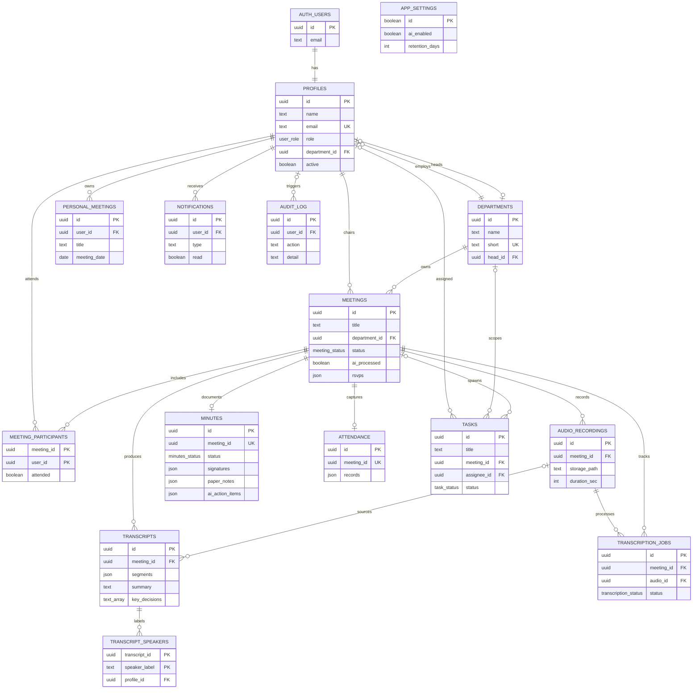
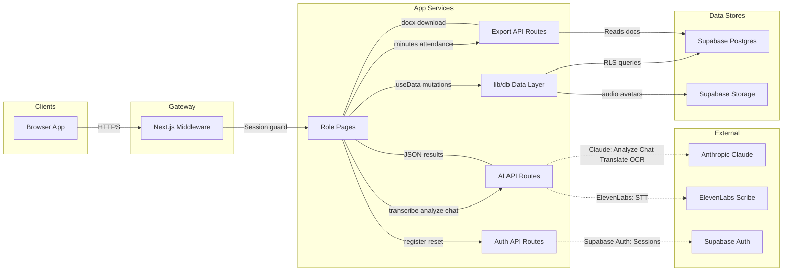
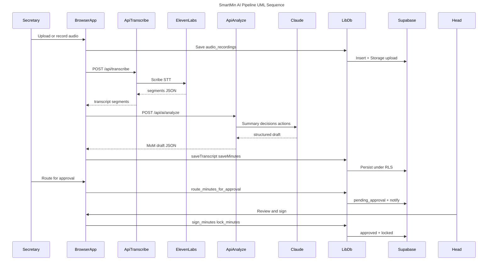
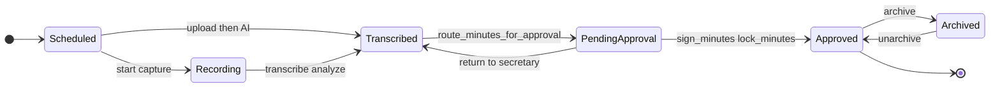

```mermaid
flowchart TB
    subgraph actors ["Actors"]
        admin(["Admin"])
        head(["Head"])
        secretary(["Secretary"])
        faculty(["Faculty"])
    end

    subgraph adminUc ["Admin"]
        a1["Manage Users"]
        a2["Manage Departments"]
        a3["View All Meetings"]
        a4["Audit and Privacy"]
        a5["System Settings"]
    end

    subgraph headUc ["Head"]
        h1["Approve and Sign Minutes"]
        h2["Delegate Tasks"]
        h3["Manage Dept Members"]
        h4["View Reports"]
        h5["Department Calendar"]
    end

    subgraph secUc ["Secretary"]
        s1["Schedule Meeting"]
        s2["Live Recording"]
        s3["Upload Audio"]
        s4["Edit Transcript"]
        s5["Edit Minutes"]
        s6["Capture Attendance"]
        s7["Route for Approval"]
        s8["Archive Meetings"]
    end

    subgraph facUc ["Faculty"]
        f1["View My Meetings"]
        f2["RSVP to Meeting"]
        f3["Track My Tasks"]
        f4["Personal Meetings"]
        f5["View Transcript"]
    end

    subgraph sharedUc ["Shared"]
        sh1["AI Assistant"]
        sh2["Profile"]
        sh3["Dashboard"]
    end

    admin --> a1 & a2 & a3 & a4 & a5
    head --> h1 & h2 & h3 & h4 & h5
    secretary --> s1 & s2 & s3 & s4 & s5 & s6 & s7 & s8
    faculty --> f1 & f2 & f3 & f4 & f5
    admin & head & secretary & faculty --> sh1 & sh2 & sh3

    style actors fill:#FFECBD,stroke:#FFC943
    style adminUc fill:#FFCDC2,stroke:#FF7556
    style headUc fill:#C2E5FF,stroke:#3DADFF
    style secUc fill:#CDF4D3,stroke:#66D575
    style facUc fill:#DCCCFF,stroke:#874FFF
    style sharedUc fill:#D9D9D9,stroke:#B3B3B3
```

# ZPPSU SmartMin — Complete System Documentation

One-file reference for diagrams, requirements, glossary, and technology stack.  
Aligned to the live Next.js + Supabase implementation (migrations `0001`–`0014`).

**FigJam board (all diagrams):** [Open editable FigJam](https://www.figma.com/board/AccyuDMagIE8U1IX1mRIF6)

---

## Table of contents

1. [System overview](#1-system-overview)
2. [Technology stack](#2-technology-stack)
3. [Terms and definitions](#3-terms-and-definitions)
4. [Functional requirements](#4-functional-requirements)
5. [Non-functional requirements](#5-non-functional-requirements)
6. [ERD diagram](#6-erd-diagram)
7. [Data flow diagram](#7-data-flow-diagram)
8. [Use case diagram](#8-use-case-diagram)
9. [Flowchart — meeting lifecycle](#9-flowchart--meeting-lifecycle)
10. [UML sequence diagram](#10-uml-sequence-diagram)
11. [UML state diagram](#11-uml-state-diagram)
12. [Roles and routes](#12-roles-and-routes)
13. [Sources of truth](#13-sources-of-truth)

---

## 1. System overview

**SmartMin** is an AI-assisted institutional meeting-governance system for  
**Zamboanga Peninsula Polytechnic State University (ZPPSU)**.

Pipeline:

```text
Audio → Transcript → Summary → Decisions → Action Items → Minutes → Approval → Archive
```

Four roles: **admin**, **head**, **secretary**, **faculty**. Data is scoped by department with Supabase RLS.

---

## 2. Technology stack

| Layer | Technology | Role in SmartMin |
|-------|------------|------------------|
| Framework | **Next.js 16** (App Router) | Pages, API routes, middleware |
| UI | **React 19** + **TypeScript 5.9** | Client pages under `app/(app)` |
| Styling | **Tailwind CSS 3** | Brand tokens (maroon `#570000`, gold `#cba72f`) |
| Auth + DB | **Supabase** (Auth, Postgres, Storage, Realtime, RLS) | Source of truth for users and meeting data |
| Data access | `lib/db.ts` + `components/DataProvider.tsx` | Snake_case ↔ camelCase mapping, mutations, RPCs |
| STT | **ElevenLabs Scribe** via `POST /api/transcribe` | Speech-to-text |
| LLM | **Anthropic Claude** via `/api/ai/*` | Analyze, chat, translate, OCR notes |
| Documents | **docx** | Minutes and attendance export |
| Charts | **Chart.js** / react-chartjs-2 | Dashboards / reports |
| Validation | **Zod** | Request/schema validation |
| Mail | **Nodemailer** | Auth/reset emails when configured |
| Hosting (dev) | `npm run dev` port **3000** | Local development |

**Not used as source of truth:** legacy `lib/store.ts` / `localStorage` (migration leftover).

---

## 3. Terms and definitions

| Term | Definition |
|------|------------|
| **MoM** | Minutes of the Meeting — formal CHED-oriented document (`minutes` table) |
| **Transcript** | Time-segmented speech text with speakers, summary, key decisions |
| **Action item** | Task extracted from discussion; staged in minutes JSON, resolved in `tasks` |
| **RLS** | Row Level Security — Postgres policies scoping rows by role/department |
| **RPC** | Supabase `SECURITY DEFINER` function (e.g. `sign_minutes`, `lock_minutes`) |
| **Grounded assistant** | AI chat that answers only from the open meeting’s transcript/notes |
| **Paper notes** | Handwritten panel notes OCR’d via Claude vision into `minutes.paper_notes` |
| **RSVP** | Invite response stored in `meetings.rsvps` JSONB (not a separate table) |
| **Signature** | Canvas/data-URL signature stored in `minutes.signatures` JSONB |
| **AI-processed** | Meeting flag after successful transcribe/analyze path |
| **Department scope** | Head/secretary/faculty only see their department’s meetings (admin sees all) |
| **Fallback pipeline** | On-device STT/summarizer/translator when API keys are missing |

---

## 4. Functional requirements

| ID | Requirement | Primary actor |
|----|-------------|----------------|
| FR-01 | Register / login / password reset with email confirmation | All |
| FR-02 | Role-based access to dashboards and pages | All |
| FR-03 | Manage users, departments, system settings, audit log | Admin |
| FR-04 | Schedule meetings with agenda, venue, participants | Secretary |
| FR-05 | Live-record or upload meeting audio to Storage | Secretary |
| FR-06 | Transcribe audio (ElevenLabs) and store segments | Secretary |
| FR-07 | Analyze transcript into summary, decisions, action items, MoM draft | Secretary |
| FR-08 | Edit transcripts and minutes; translate EN↔Tagalog | Secretary |
| FR-09 | OCR handwritten notes and keep them with minutes | Secretary |
| FR-10 | Capture attendance with per-attendee signatures; export `.docx` | Secretary |
| FR-11 | Route minutes for head approval; notify chair | Secretary |
| FR-12 | Review, sign, approve/lock, or return minutes | Head |
| FR-13 | Delegate tasks to faculty; manage department members | Head |
| FR-14 | View calendar, reports, department KPIs | Head |
| FR-15 | RSVP to meetings; track assigned tasks | Faculty |
| FR-16 | View permitted transcripts / personal meetings | Faculty |
| FR-17 | Use grounded AI assistant scoped to an open meeting | All |
| FR-18 | Archive / unarchive approved meetings | Secretary |
| FR-19 | Export minutes document | Secretary / Head |
| FR-20 | Audit privacy-sensitive actions | Admin |

---

## 5. Non-functional requirements

| ID | Category | Requirement |
|----|----------|-------------|
| NFR-01 | Security | API keys server-only (`process.env`); never `NEXT_PUBLIC_` for secrets |
| NFR-02 | Security | Supabase RLS + `useRequireRole` + middleware session refresh |
| NFR-03 | Privacy | Audit log; retention settings in `app_settings`; data-processing notice |
| NFR-04 | Reliability | AI routes degrade to local fallbacks when unconfigured |
| NFR-05 | Integrity | Locked minutes require amend RPC to reopen; signatures retained in JSONB |
| NFR-06 | Usability | UI matches ZPPSU brand (maroon/gold); Material Symbols icons |
| NFR-07 | Localization | Bilingual English / Tagalog for transcript and minutes content |
| NFR-08 | Performance | Client caches RLS-scoped collections via `DataProvider`; refresh after mutations |
| NFR-09 | Maintainability | Schema in versioned SQL migrations; app fields in additive `0011+` |
| NFR-10 | Availability | Realtime notifications (`0014`); storage paths gated by meeting visibility |
| NFR-11 | Compliance | CHED-style minutes layout (date, participants, discussion, decisions, actions, approval) |
| NFR-12 | Portability | Next.js App Router deployable; env via `.env.local` / `.env.example` |

---

## 6. ERD diagram

**Purpose:** Tables, keys, and cardinalities for SmartMin Postgres.


[Edit in FigJam](https://www.figma.com/board/AccyuDMagIE8U1IX1mRIF6)



**Modeling notes:** Signatures, RSVPs, and approvals are JSONB / RPCs — not separate tables.

---

## 7. Data flow diagram

**Purpose:** Browser → middleware → pages/API → Claude / ElevenLabs / Auth → Postgres + Storage.


[Edit in FigJam](https://www.figma.com/board/AccyuDMagIE8U1IX1mRIF6)



### API routes

| Route | Purpose |
|-------|---------|
| `POST /api/transcribe` | ElevenLabs STT |
| `POST /api/ai/analyze` | Summary, decisions, actions, MoM draft |
| `POST /api/ai/chat` | Grounded assistant |
| `POST /api/ai/translate` | EN ↔ Tagalog |
| `POST /api/ai/read-notes` | Handwriting OCR |
| `POST /api/export/minutes` | Minutes `.docx` |
| `POST /api/export/attendance` | Signed attendance export |
| `/api/auth/*` | Register, forgot password, resend confirmation |
| `/api/admin/users` | Admin user CRUD |
| `/api/head/members` | Department member management |
| `GET /api/departments` | Department list |

---

## 8. Use case diagram

**Purpose:** Capabilities per actor. (UML oval use-case syntax is not supported by FigJam `generate_diagram`; this is an equivalent actor→capability map.)


[Edit in FigJam](https://www.figma.com/board/AccyuDMagIE8U1IX1mRIF6)



---

## 9. Flowchart — meeting lifecycle

**Purpose:** Secretary + Head end-to-end process with approve/return branch.


[Edit in FigJam](https://www.figma.com/board/AccyuDMagIE8U1IX1mRIF6)



```mermaid
flowchart LR
    start(["Start"]) --> schedule["Schedule Meeting"]
    schedule --> record{{"Record or Upload?"}}
    record -->|"Live"| liveRec["Live Recording"]
    record -->|"File"| upload["Upload Audio"]
    liveRec --> saveAudio["Save audio_recordings"]
    upload --> saveAudio
    saveAudio --> transcribe["POST /api/transcribe"]
    transcribe --> analyze["POST /api/ai/analyze"]
    analyze --> editMom["Edit MoM Draft"]
    editMom --> attendance["Capture Attendance"]
    attendance --> routeAppr["route_minutes_for_approval"]
    routeAppr --> headReview["Head Reviews"]
    headReview --> decision{{"Approve?"}}
    decision -->|"Yes"| signLock["sign_minutes + lock_minutes"]
    decision -->|"No"| returned["Return to Secretary"]
    returned -.-> editMom
    signLock --> approved["Status approved"]
    approved --> archive["Archive Meeting"]
    archive --> done(["Done"])

    style schedule fill:#C2E5FF,stroke:#3DADFF
    style transcribe fill:#DCCCFF,stroke:#874FFF
    style analyze fill:#DCCCFF,stroke:#874FFF
    style routeAppr fill:#FFECBD,stroke:#FFC943
    style signLock fill:#CDF4D3,stroke:#66D575
    style returned fill:#FFCDC2,stroke:#FF7556
    style archive fill:#D9D9D9,stroke:#B3B3B3
```

| Step | Meeting status | Minutes status |
|------|----------------|----------------|
| Schedule | `scheduled` | — |
| Transcribe / analyze | `transcribed` | `draft` |
| Route approval | `pending_approval` | `pending_approval` |
| Sign + lock | `approved` | `approved` |
| Return | `transcribed` | `draft` |
| Archive | `archived` | `approved` |

---

## 10. UML sequence diagram

**Purpose:** Time-ordered interactions for the AI pipeline and approval (UML interaction view).  
**Note:** UML *class* diagrams are not supported by FigJam `generate_diagram`; use the ERD for structural model.


[Edit in FigJam](https://www.figma.com/board/AccyuDMagIE8U1IX1mRIF6)



---

## 11. UML state diagram

**Purpose:** `meeting_status` state machine.


[Edit in FigJam](https://www.figma.com/board/AccyuDMagIE8U1IX1mRIF6)



---

## 12. Roles and routes

| Role | Key routes |
|------|------------|
| Admin | `/admin/dashboard`, `/admin/users`, `/admin/departments`, `/admin/meetings`, `/admin/audit`, `/admin/settings` |
| Head | `/head/dashboard`, `/head/calendar`, `/head/approvals`, `/head/delegate`, `/head/members`, `/head/reports` |
| Secretary | `/secretary/schedule`, `/secretary/live-recording`, `/secretary/upload-audio`, `/secretary/transcript`, `/secretary/mom-editor`, `/secretary/attendance`, `/secretary/archives` |
| Faculty | `/faculty/dashboard`, `/faculty/my-meetings`, `/faculty/my-tasks`, `/faculty/personal-meetings`, `/faculty/transcript-view` |
| Shared | `/assistant`, `/profile` |

---

## 13. Sources of truth

| Concern | Canonical source |
|---------|------------------|
| Schema | `supabase/migrations/*.sql` |
| App types | `lib/types.ts` |
| Mutations / RPCs | `lib/db.ts`, `0003_functions.sql` |
| Nav / use cases | `lib/nav.ts` |
| AI / export APIs | `app/api/**` |
| Brand / theme | `tailwind.config.ts`, `app/globals.css` |
| Env names | `.env.example` |

**Regenerate / refresh:** use project skill `.cursor/skills/smartmin-system-diagrams` and reuse FigJam `fileKey=AccyuDMagIE8U1IX1mRIF6`.
