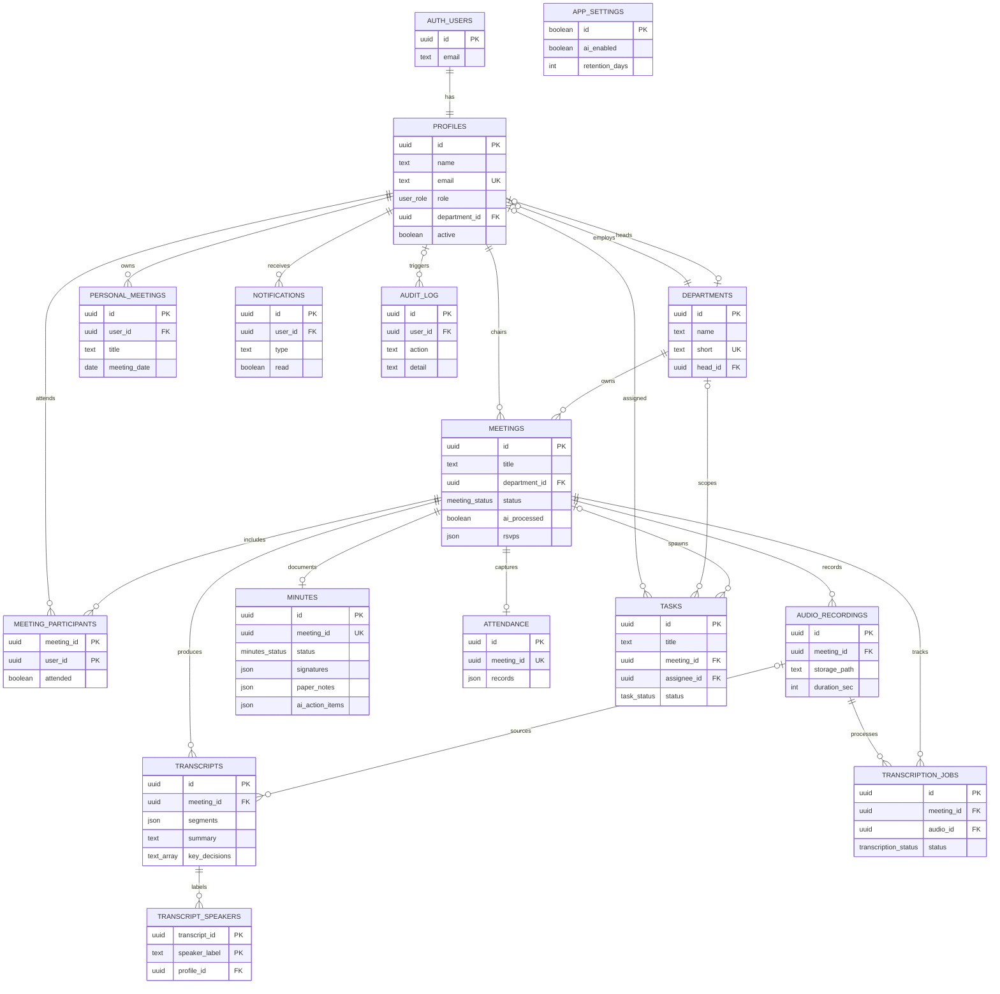

# 1. Entity-Relationship Diagram (ERD)

SmartMin Postgres schema as used by the live Supabase backend.

**FigJam:** [SmartMin ERD](https://www.figma.com/board/AccyuDMagIE8U1IX1mRIF6)  
**Sources:** `supabase/migrations/0001_schema.sql`, `0008`, `0010`–`0014`, `lib/types.ts`

---

## Visual

---

## Mermaid (renders in Markdown preview)

---

## Key design notes

| Concept | How it is modeled |
|---------|-------------------|
| Signatures / approvals | `minutes.signatures` jsonb + RPCs `sign_minutes`, `lock_minutes`, `route_minutes_for_approval` |
| RSVP | `meetings.rsvps` jsonb + `set_meeting_rsvp` (not a table) |
| Action items | `minutes.ai_action_items` / `action_items` → resolved rows in `tasks` |
| Storage | Buckets `meeting-audio`, `avatars` (not SQL entities) |
| Meeting status | `scheduled` → `recording` → `transcribed` → `pending_approval` → `approved` → `archived` |
