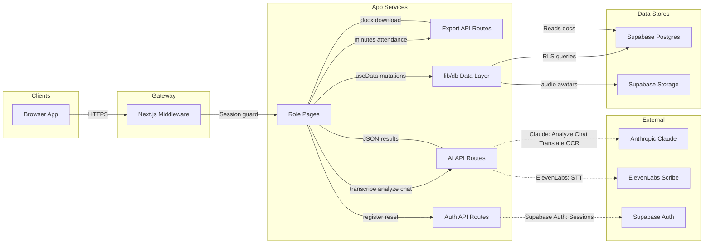

# 2. Data Flow Diagram

How data moves through SmartMin: browser → Next.js → AI/Auth providers → Supabase.

**FigJam:** [SmartMin Data Flow Architecture](https://www.figma.com/board/AccyuDMagIE8U1IX1mRIF6)  
**Sources:** `app/api/**`, `lib/db.ts`, `lib/ai-client.ts`, `middleware.ts`, `components/DataProvider.tsx`

---

## Visual

[](https://www.figma.com/board/AccyuDMagIE8U1IX1mRIF6)

---

## Mermaid (architecture lanes)



---

## AI product pipeline

```text
Audio (live / upload)
  → Storage audio_recordings
  → POST /api/transcribe          (ElevenLabs)
  → POST /api/ai/analyze          (Claude)
  → saveTranscript / saveMinutes / tasks  (lib/db)
  → optional: /api/ai/translate | read-notes | chat
```

Fallbacks when keys are missing: `lib/transcriber.ts`, `lib/summarizer.ts`, `lib/translator.ts`.

---

## API route map

| Route | Purpose |
|-------|---------|
| `POST /api/transcribe` | ElevenLabs STT |
| `POST /api/ai/analyze` | Summary, decisions, action items, MoM draft |
| `POST /api/ai/chat` | Grounded meeting assistant |
| `POST /api/ai/translate` | EN ↔ Tagalog |
| `POST /api/ai/read-notes` | Handwriting OCR → `paper_notes` |
| `POST /api/export/minutes` | Minutes `.docx` |
| `POST /api/export/attendance` | Signed attendance export |
| `POST /api/auth/register` | Self-registration |
| `POST /api/auth/forgot-password` | Reset email |
| `POST /api/auth/resend-confirmation` | Confirm email |
| `POST/PATCH/DELETE /api/admin/users` | Admin user CRUD |
| `POST/PATCH /api/head/members` | Department members |
| `GET /api/departments` | Department list |
