# 3. Use Case Diagram

Role-based capabilities for SmartMin. Rendered as an actor → use-case flowchart (UML use-case syntax is not supported by FigJam `generate_diagram`).

**FigJam:** [SmartMin Use Case Diagram](https://www.figma.com/board/AccyuDMagIE8U1IX1mRIF6)  
**Sources:** `lib/nav.ts`, `app/(app)/**`

---

## Visual

---

## Mermaid

```mermaid
flowchart TB
    subgraph actors ["Actors"]
        admin(["Admin"])
        head(["Head"])
        secretary(["Secretary"])
        faculty(["Faculty"])
    end

    subgraph adminUc ["Admin"]
        a1["Manage Users"]
        a2["Manage Departments"]
        a3["View All Meetings"]
        a4["Audit and Privacy"]
        a5["System Settings"]
    end

    subgraph headUc ["Head"]
        h1["Approve and Sign Minutes"]
        h2["Delegate Tasks"]
        h3["Manage Dept Members"]
        h4["View Reports"]
        h5["Department Calendar"]
    end

    subgraph secUc ["Secretary"]
        s1["Schedule Meeting"]
        s2["Live Recording"]
        s3["Upload Audio"]
        s4["Edit Transcript"]
        s5["Edit Minutes"]
        s6["Capture Attendance"]
        s7["Route for Approval"]
        s8["Archive Meetings"]
    end

    subgraph facUc ["Faculty"]
        f1["View My Meetings"]
        f2["RSVP to Meeting"]
        f3["Track My Tasks"]
        f4["Personal Meetings"]
        f5["View Transcript"]
    end

    subgraph sharedUc ["Shared"]
        sh1["AI Assistant"]
        sh2["Profile"]
        sh3["Dashboard"]
    end

    admin --> a1 & a2 & a3 & a4 & a5
    head --> h1 & h2 & h3 & h4 & h5
    secretary --> s1 & s2 & s3 & s4 & s5 & s6 & s7 & s8
    faculty --> f1 & f2 & f3 & f4 & f5
    admin & head & secretary & faculty --> sh1 & sh2 & sh3

    style actors fill:#FFECBD,stroke:#FFC943
    style adminUc fill:#FFCDC2,stroke:#FF7556
    style headUc fill:#C2E5FF,stroke:#3DADFF
    style secUc fill:#CDF4D3,stroke:#66D575
    style facUc fill:#DCCCFF,stroke:#874FFF
    style sharedUc fill:#D9D9D9,stroke:#B3B3B3
```

---

## Use case inventory (routes)

| Actor | Use case | Route |
|-------|----------|-------|
| Admin | Dashboard | `/admin/dashboard` |
| Admin | User Management | `/admin/users` |
| Admin | Departments | `/admin/departments` |
| Admin | All Meetings | `/admin/meetings` |
| Admin | Audit & Privacy | `/admin/audit` |
| Admin | System Settings | `/admin/settings` |
| Head | Approvals & Signing | `/head/approvals` |
| Head | Task Delegation | `/head/delegate` |
| Head | Department Members | `/head/members` |
| Head | Reports | `/head/reports` |
| Head | Calendar | `/head/calendar` |
| Secretary | Schedule | `/secretary/schedule` |
| Secretary | Live Recording | `/secretary/live-recording` |
| Secretary | Upload Audio | `/secretary/upload-audio` |
| Secretary | Transcripts | `/secretary/transcript` |
| Secretary | MoM Editor | `/secretary/mom-editor` |
| Secretary | Attendance | `/secretary/attendance` |
| Secretary | Archives | `/secretary/archives` |
| Faculty | My Meetings / RSVP | `/faculty/my-meetings` |
| Faculty | My Tasks | `/faculty/my-tasks` |
| Faculty | Personal Meetings | `/faculty/personal-meetings` |
| Faculty | Transcript View | `/faculty/transcript-view` |
| All | AI Assistant | `/assistant` |
| All | Profile | `/profile` |
