# 4. Meeting Lifecycle Flowchart

End-to-end process from secretary scheduling through head approval and archive.

**FigJam:** [SmartMin Meeting Lifecycle Flowchart](https://www.figma.com/board/AccyuDMagIE8U1IX1mRIF6)  
**Sources:** `app/(app)/secretary/**`, `app/(app)/head/approvals`, `0003_functions.sql` RPCs

---

## Visual

[](https://www.figma.com/board/AccyuDMagIE8U1IX1mRIF6)

---

## Mermaid

```mermaid
flowchart LR
    start(["Start"]) --> schedule["Schedule Meeting"]
    schedule --> record{{"Record or Upload?"}}
    record -->|"Live"| liveRec["Live Recording"]
    record -->|"File"| upload["Upload Audio"]
    liveRec --> saveAudio["Save audio_recordings"]
    upload --> saveAudio
    saveAudio --> transcribe["POST /api/transcribe"]
    transcribe --> analyze["POST /api/ai/analyze"]
    analyze --> editMom["Edit MoM Draft"]
    editMom --> attendance["Capture Attendance"]
    attendance --> routeAppr["route_minutes_for_approval"]
    routeAppr --> headReview["Head Reviews"]
    headReview --> decision{{"Approve?"}}
    decision -->|"Yes"| signLock["sign_minutes + lock_minutes"]
    decision -->|"No"| returned["Return to Secretary"]
    returned -.-> editMom
    signLock --> approved["Status approved"]
    approved --> archive["Archive Meeting"]
    archive --> done(["Done"])

    style schedule fill:#C2E5FF,stroke:#3DADFF
    style transcribe fill:#DCCCFF,stroke:#874FFF
    style analyze fill:#DCCCFF,stroke:#874FFF
    style routeAppr fill:#FFECBD,stroke:#FFC943
    style signLock fill:#CDF4D3,stroke:#66D575
    style returned fill:#FFCDC2,stroke:#FF7556
    style archive fill:#D9D9D9,stroke:#B3B3B3
```



---

## Status transitions

| Step | Actor | Meeting status | Minutes status |
|------|-------|----------------|----------------|
| Schedule | Secretary | `scheduled` | — |
| Record / upload | Secretary | `recording` (optional) | — |
| Transcribe + analyze | Secretary + AI | `transcribed` | `draft` |
| Edit MoM / attendance | Secretary | `transcribed` | `draft` |
| Route for approval | Secretary | `pending_approval` | `pending_approval` |
| Sign + lock | Head | `approved` | `approved` |
| Return | Head | `transcribed` | `draft` |
| Archive | Secretary | `archived` | `approved` |

---

## Head approval RPCs

```text
Queue: meetings where status in (pending_approval, approved)
  → Review minutes + tasks
  → sign_minutes(p_minutes_id, role, dataUrl)
  → lock_minutes → minutes + meeting = approved; notify secretary
  → OR returnMinutes → bounce to transcribed; notify secretary
  → Post-lock amend: amend_minutes → unlock, drop approving sigs, re-queue
```
